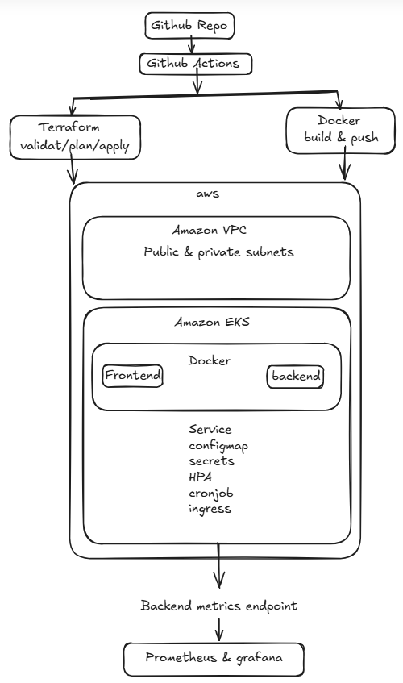

## Project Overview

This project demonstrates the implementation of a complete DevOps workflow on AWS using Infrastructure as Code, containerization, Kubernetes orchestration, monitoring, and CI/CD automation.

The solution provisions an Amazon EKS cluster using Terraform, deploys a containerized two-tier microservices application using Helm charts, and integrates monitoring and automation components to support scalable and maintainable deployments.

## Prerequisites

Before deploying this project, ensure the following tools and services are available:

### AWS

* AWS Account
* IAM User with permissions for:

  * VPC
  * EKS
  * EC2
  * IAM
  * S3
  * DynamoDB

### Local Tools

* Terraform >= 1.5
* AWS CLI >= 2.x
* kubectl
* Helm 3
* Docker
* Git

### AWS Resources

* S3 Bucket for Terraform Remote State
* DynamoDB Table for Terraform State Locking

### Container Registry

* DockerHub Account
* DockerHub Repository for:

  * Frontend Image
  * Backend Image

### GitHub

* GitHub Repository
* GitHub Actions Enabled

### Required GitHub Secrets

```text
AWS_ACCESS_KEY_ID
AWS_SECRET_ACCESS_KEY
DOCKER_USERNAME
DOCKER_PASSWORD
```

### Kubernetes

* Access to the Amazon EKS Cluster
* kubeconfig configured using:

```bash
aws eks update-kubeconfig \
  --region us-east-1 \
  --name dev-cluster
```
## Architecture Diagram



## Follow these steps to perform Hands-on:

## Getting Started

This section explains how to deploy the project from scratch in your own AWS account.

### Clone the Repository

```bash
git clone <repository-url>
cd <repository-name>
```

---

### Understand the Project Structure

Before deployment, review the repository structure:

```text
terraform/     -> Infrastructure as Code
app/           -> Frontend and Backend source code
helm/          -> Kubernetes Helm Charts
.github/       -> CI/CD Pipelines
```

---

### Prerequisites Setup

Install the following tools:

* AWS CLI
* Terraform
* Docker
* kubectl
* Helm
* Git

Verify installation:

```bash
aws --version
terraform --version
docker --version
kubectl version --client
helm version
```

---

### Configure AWS Access

Configure AWS credentials:

```bash
aws configure
```

Verify access:

```bash
aws sts get-caller-identity
```

Expected output should show your AWS Account ID.

---

### Create Terraform Backend Resources

Terraform state is stored remotely.

Create:

* S3 Bucket
* DynamoDB Table

Example:

```text
Bucket Name:
my-terraform-state-bucket

DynamoDB Table:
terraform-locks
```

Update:

```text
terraform/backend.tf
```

with your values.

---

### Review Terraform Variables

Open:

```text
terraform/terraform.tfvars
```

Update:

```hcl
environment = "dev"
aws_region  = "us-east-1"
```

Adjust values according to your environment.

---

### Provision Infrastructure

Navigate to Terraform directory:

```bash
cd terraform
```

Initialize Terraform:

```bash
terraform init
```

Review execution plan:

```bash
terraform plan
```

Create infrastructure:

```bash
terraform apply
```

Resources created:

* VPC
* Public Subnets
* Private Subnets
* Internet Gateway
* Route Tables
* EKS Cluster
* Managed Node Group

---

### Verify EKS Cluster

Configure kubectl:

```bash
aws eks update-kubeconfig \
  --region us-east-1 \
  --name <cluster-name>
```

Verify cluster:

```bash
kubectl get nodes
```

Expected:

```text
STATUS: Ready
```

---

### Build Application Images

Build backend image:

```bash
docker build \
-t <dockerhub-username>/backend:v1 \
./app/backend
```

Build frontend image:

```bash
docker build \
-t <dockerhub-username>/frontend:v1 \
./app/frontend
```

---

### Push Images to DockerHub

Login:

```bash
docker login
```

Push images:

```bash
docker push <dockerhub-username>/backend:v1
docker push <dockerhub-username>/frontend:v1
```

---

### Configure Helm Values

Open:

```text
helm/devops-app/values.yaml
```

Update image repositories:

```yaml
frontend:
  image:
    repository: <dockerhub-username>/frontend

backend:
  image:
    repository: <dockerhub-username>/backend
```

Update secrets:

```yaml
secret:
  dbPassword: "<your-password>"
```

Update environment-specific values as required.

---

### Deploy Application

Create namespace:

```bash
kubectl create namespace dev
```

Deploy Helm chart:

```bash
cd helm/devops-app

helm install devops-app . -n dev
```

---

### Verify Deployment

Check deployments:

```bash
kubectl get deployments -n dev
```

Check services:

```bash
kubectl get svc -n dev
```

Check pods:

```bash
kubectl get pods -n dev
```

---

### Deploy Monitoring Stack (Optional)

Prometheus Chart:

```bash
cd helm/prometheus
helm install prometheus .
```

Grafana Chart:

```bash
cd helm/grafana
helm install grafana .
```

---

### Configure GitHub Actions

Add repository secrets:

```text
AWS_ACCESS_KEY_ID
AWS_SECRET_ACCESS_KEY
DOCKER_USERNAME
DOCKER_PASSWORD
```

Navigate to:

GitHub Repository → Settings → Secrets and Variables → Actions

Add your own credentials.

---

### Trigger CI/CD Pipeline

Create a feature branch:

```bash
git checkout -b feature/update
```

Push changes:

```bash
git add .
git commit -m "update"
git push origin feature/update
```

Create a Pull Request to trigger validation workflows.

Merge into main branch to trigger deployment workflows.

---

### Cleanup Resources

Destroy infrastructure:

```bash
cd terraform

terraform destroy
```

This removes all AWS resources created by the project.


